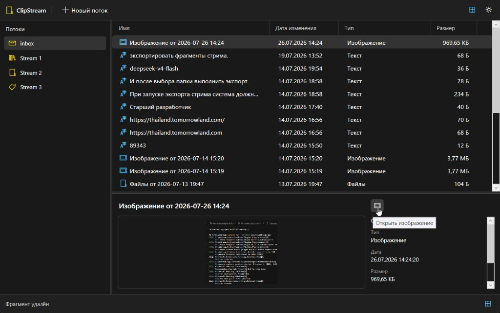

# ClipStream
!!! AI agent–generated app; no manual coding involved. !!!

Windows clipboard manager with stream-based history, plugin pipeline, and Markdown export.



## Features

### Clipboard monitoring
- Win32 `AddClipboardFormatListener` / `WM_CLIPBOARDUPDATE` on a hidden host window
- 100 ms debounce and sequence-number dedup
- Sticky own-write suppress: own `SetDataObject` updates are ignored by sequence after write
- Privacy filter skips password-manager / exclude formats (`Clipboard Viewer Ignore`, `ExcludeClipboardContentFromMonitorProcessing`, zeroed `CanIncludeInClipboardHistory` / `CanUploadToCloudClipboard`)
- Source process from `GetClipboardOwner` (fallback: foreground window)

### Capture and plugins
- Raw multi-format capture with OpenClipboard retries
- Plugin pipeline: first matching format plugin by priority, then enrichers
- Built-in formats: text, HTML, image, files, generic binary fallback
- Content-hash (SHA-256) deduplication before save

### Streams and routing
- Named streams with icons; default `inbox` stream
- Drag-and-drop fragments between streams
- Routing engine (regex / kind / source process / format rules) — persisted in SQLite; no rule editor UI yet (without rules everything goes to inbox)

### UI
- Main window: streams list + fragment list (kind, title, preview, time)
- Tray icon: show / exit; minimize hides to tray
- Dark / light theme (persisted in settings)
- Context actions: paste to active window, export to folder
- Editable fragment titles

### Paste
- Rebuild clipboard payloads from blob store
- Paste to last external foreground window (activate + Ctrl+V)

### Export
- Export fragment or stream to a folder as Markdown with YAML frontmatter
- Optional attachments under `attachments/` (content-addressed copies)
- Filename from title slug with uniqueness suffixes

## Build

```powershell
dotnet build ClipStream.sln
dotnet test ClipStream.sln
dotnet run --project src/ClipStream.App
```

## Release

Push a version tag to publish a self-contained Windows build to GitHub Releases:

```powershell
git tag v0.1.0
git push origin v0.1.0
```

The [Release](.github/workflows/release.yml) workflow runs tests, publishes `win-x64` (self-contained single-file), zips the output, and attaches it to a new GitHub Release.

## Architecture

| Project | Role |
|---------|------|
| `ClipStream.App` | WPF UI, tray, clipboard host window, themes |
| `ClipStream.Core` | Domain models and service contracts |
| `ClipStream.Clipboard` | Win32 listener, capture, privacy filter, paste |
| `ClipStream.Infrastructure` | SQLite, blob store, plugin loader, routing |
| `ClipStream.Export` | Markdown directory exporter |
| `ClipStream.Plugins.Abstractions` | Plugin contracts |
| `ClipStream.Plugins.BuiltIn` | Format plugins and paste/export actions |

## Data

| Path | Contents |
|------|----------|
| `%AppData%/ClipStream/clipstream.db` | SQLite (streams, fragments, payloads, routing rules) |
| `%AppData%/ClipStream/blobs/` | Content-addressed binary payloads |
| `%AppData%/ClipStream/settings.json` | UI settings (theme) |
| `%AppData%/ClipStream/plugins/*.dll` | User plugins |

## Plugins

Built-in plugins are registered via DI. Custom DLLs implementing `IClipStreamPlugin` can be placed in `%AppData%/ClipStream/plugins/`.

See **[Plugin API](docs/plugins.md)** for interfaces, loading rules, and examples (format, enricher, fragment/stream actions).
